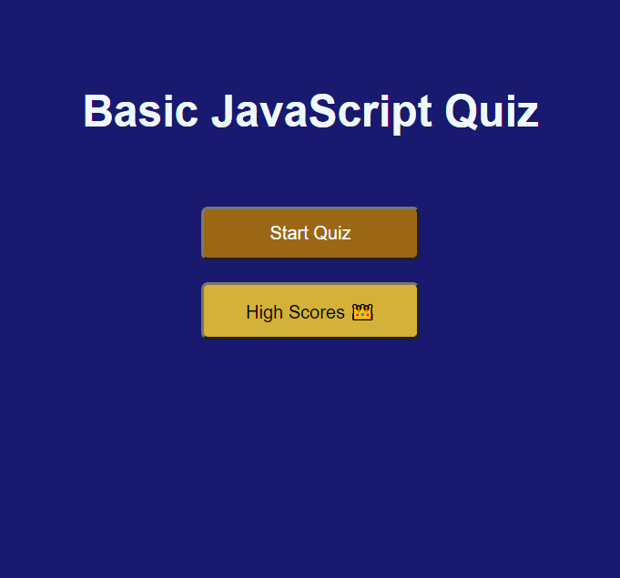

# coding-quiz-assessment
As developer, I'm making an assessment for myself or other developers-in-training in a form of multiple choice questions in order to assesst our familiarity in basic JavaScript. Test-takers will be given limited amount of time to answer all questions and time will start ticking as soon as they click on "begin". Scores will be displayed at the end. 

## URL
Deployed: https://binnie51.github.io/coding-quiz-assessment/

## Technologies
* HTML
* CSS
* JavaScript

## Screenshots


Taking the quiz itself 

## User Story

```
AS A coding boot camp student
I WANT to take a timed quiz on JavaScript fundamentals that stores high scores
SO THAT I can gauge my progress compared to my peers
```

## Acceptance Criteria

```
GIVEN I am taking a code quiz
WHEN I click the start button
THEN a timer starts and I am presented with a question
WHEN I answer a question
THEN I am presented with another question
WHEN I answer a question incorrectly
THEN time is subtracted from the clock
WHEN all questions are answered or the timer reaches 0
THEN the game is over
WHEN the game is over
THEN I can save my initials and my score
```
## License
Copyright (c) Vincent Tjia. All rights reserved.
License under MIT.